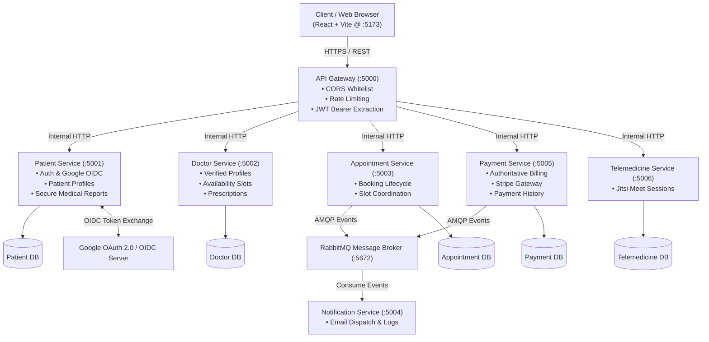

# Healthcare Microservices System — Secure Architecture & DevSecOps Implementation

[](https://www.sliit.lk)
[-success.svg)](https://github.com/matheeshaW/Secure-Software-Development-For-Health-Care-System)
[](https://developers.google.com/identity/protocols/oauth2)
[](https://www.docker.com/)
[](https://nodejs.org/)
[](https://www.rabbitmq.com/)

An enterprise-grade, containerized Node.js healthcare platform engineered with microservices architecture, event-driven messaging, federated authentication (Google OAuth 2.0 / OpenID Connect), comprehensive STRIDE threat modeling, and defense-in-depth security hardening remediating 10 critical security vulnerabilities.

---

## 1. Academic & Group Credentials

- **Institution**: Sri Lanka Institute of Information Technology (SLIIT)
- **Faculty**: Faculty of Computing — Department of Software Engineering
- **Module**: SE4030 — Secure Software Development
- **Assessment**: Assignment 01 (Academic Year 2026)
- **Group Number**: Group 42
- **Repository**: [matheeshaW/Secure-Software-Development-For-Health-Care-System](https://github.com/matheeshaW/Secure-Software-Development-For-Health-Care-System)

### Group Members & Technical Leadership

| Member Name | Student ID | Core Technical Roles & Project Responsibilities |
| :--- | :--- | :--- |
| **Weerakoon W.M.M.B** | **IT23155152** | **System Architecture, API Gateway Hardening (V8, V9) & Google OAuth 2.0 / OIDC Lead**<br>Reverse proxy routing, CORS whitelisting, RFC 6750 Bearer token extraction, tiered sliding-window rate limiting, and federated Google OAuth 2.0 / OpenID Connect authorization code flow. |
| **Kahakotuwa K.N** | **IT23432284** | **Patient Domain Security (V1, V2) & STRIDE Threat Modeling Lead**<br>Threat modeling (DFD Level 0/1), secrets management & externalization, DTO mass-assignment prevention, and password hash leakage elimination. |
| **Herath H.M.N.P** | **IT23221178** | **Clinical & Financial Services Security (V3, V4, V5, V6) & DAST Lead**<br>Dynamic Application Security Testing (OWASP ZAP), BOLA/IDOR remediation in medical records and payments, NoSQL injection neutralization, and server-side authoritative billing recalculation. |
| **Liyanage H.G.W.R** | **IT23163690** | **Supply Chain Security (V7, V10), File Handling Security & SAST Lead**<br>Static code analysis, Software Composition Analysis (OWASP Dependency-Check v9.0.9), multi-tier unrestricted file upload validation (magic bytes, MIME, SHA-256 UUIDs), and DevSecOps justification. |

---

## 2. System Architecture & Microservices Overview

The platform adopts a decoupled microservices architecture deployed via Docker Compose. All client ingress traffic is routed through a single API Gateway reverse proxy that enforces edge security policies before dispatching requests across an isolated internal Docker bridge network.



### Microservices Catalog

| Service Name | Port | Primary Responsibilities | Key Security Controls Implemented |
| :--- | :---: | :--- | :--- |
| **api-gateway** | `5000` | Central reverse proxy, request routing, authentication verification | Strict CORS whitelisting, RFC 6750 Bearer token extraction, tiered sliding-window rate limiting |
| **patient-service** | `5001` | Patient registration, login, Google OAuth 2.0 / OIDC, profiles, medical reports | Strict DTO allowlisting, password hash exclusion, BOLA ownership checks, magic byte file validation |
| **doctor-service** | `5002` | Doctor profiles, admin verification, availability scheduling, prescriptions | Admin-only profile verification, parameterized NoSQL queries, cryptographic role enforcement |
| **appointment-service**| `5003` | Consultation booking, slot reservation, async event publishing | Upstream slot state validation, JWT identity binding, RabbitMQ event signing |
| **notification-service** | `5004` | Async event consumer, transactional notification dispatch | Secure SMTP credentialing, internal RabbitMQ queue isolation, input sanitization |
| **payment-service** | `5005` | Payment processing, Stripe checkout sessions, transaction history | Server-side authoritative price recalculation, cross-tenant BOLA isolation, payment history authorization |
| **telemedicine-service**| `5006` | Secure video consultation session token generation | Jitsi JWT room isolation, appointment attendance verification |
| **frontend** | `5173` | Responsive patient/doctor clinical portal (React + Vite + Tailwind) | Input validation, XSS prevention, secure token storage, responsive UI |
| **rabbitmq** | `5672` / `15672` | Asynchronous message broker for cross-service events | Isolated internal Docker network, authenticated AMQP channels |

---

## 3. Threat Modeling & Trust Boundaries (STRIDE)

The system boundary analysis identifies four distinct **Trust Boundaries (TB)**:

- **TB1: Public Internet to API Gateway**: Ingress boundary traversed by untrusted client web browsers. Subject to spoofing, brute force, DDoS, and parameter manipulation.
- **TB2: API Gateway to Internal Microservices Network**: Protected private Docker bridge network. Enforces authenticated identity propagation via verified JWT claims.
- **TB3: Microservices to Persistence Layer**: Internal database connections to MongoDB instances and Cloudinary storage.
- **TB4: Microservices to External Identity & Payment Providers**: Secure TLS channels to Google OAuth 2.0 / OIDC endpoints and Stripe APIs.

### STRIDE Assessment Summary

| Threat Category | Target Component | Identified Threat Vector | Architectural Mitigation Implemented |
| :--- | :--- | :--- | :--- |
| **Spoofing** | API Gateway & Patient Service | Token forging, credential stuffing, fake identity claims | Externalized secrets (V1), RFC 6750 Bearer token enforcement (V8), Google OIDC RS256 signature verification |
| **Tampering** | Payment Service & Gateway | Client-side price tampering, query token tampering | Server-side authoritative fee calculation (V6), query token rejection (V8) |
| **Repudiation** | Appointment & Payment Services | Disputing appointment bookings or transactions | Authoritative audit trails, RabbitMQ immutable event streams |
| **Information Disclosure** | Patient & Payment Services | Password hash leakage, cross-tenant data access, CORS leakage | Password hash projection removal (V2), BOLA ownership checks (V3, V4), CORS origin whitelisting (V8) |
| **Denial of Service** | API Gateway & Patient Service | Unrestricted file uploads filling disk, API brute-forcing | 5MB file cap & MIME/signature validation (V7), tiered sliding-window rate limiting (V9) |
| **Elevation of Privilege** | Patient Service & Doctor Service | Mass-assignment privilege escalation, unverified doctor actions | Strict DTO allowlisting (V2), admin-gated doctor verification workflows |

---

## 4. Vulnerability Catalog & Remediation Matrix (V1 – V10)

All 10 security vulnerabilities identified during initial static and dynamic assessments have been fully remediated and verified using automated test suites.

| ID | Vulnerability Title | Target Service | CWE | OWASP Top 10 (2021) | Severity | Status |
| :---: | :--- | :--- | :--- | :--- | :---: | :---: |
| **V1** | Hardcoded JWT Secrets & Insecure Key Management | `api-gateway`, `patient-service`, `doctor-service`, `appointment-service` | CWE-798 | A02:2021 - Cryptographic Failures | Critical | **Remediated** |
| **V2** | Mass Assignment & Sensitive Data Exposure in Patient Auth | `patient-service` | CWE-915, CWE-200 | A01:2021 - Broken Access Control | High | **Remediated** |
| **V3** | Broken Object Level Authorization (BOLA) in Medical Reports | `patient-service` | CWE-639 | A01:2021 - Broken Access Control | High | **Remediated** |
| **V4** | Broken Object Level Authorization (BOLA) in Payment Records | `payment-service` | CWE-639 | A01:2021 - Broken Access Control | High | **Remediated** |
| **V5** | NoSQL Query Injection in Doctor Search & Filter | `doctor-service` | CWE-943 | A03:2021 - Injection | High | **Remediated** |
| **V6** | Client-Side Price Tampering in Consultation Payments | `payment-service` | CWE-472 | A04:2021 - Insecure Design | High | **Remediated** |
| **V7** | Unrestricted File Upload & Remote Code Execution (RCE) | `patient-service` | CWE-434 | A04:2021 - Insecure Design | Critical | **Remediated** |
| **V8** | API Gateway Security Misconfiguration (CORS & Query Tokens) | `api-gateway` | CWE-16, CWE-598 | A05:2021 - Security Misconfiguration | Medium | **Remediated** |
| **V9** | Unrestricted Resource Consumption & Missing Rate Limiting | `api-gateway` | CWE-770 | A04:2021 - Insecure Design | Medium | **Remediated** |
| **V10**| Outdated & Vulnerable Third-Party Dependencies (SCA) | All Services | CWE-1395 | A06:2021 - Vulnerable Components | High | **Remediated** |

---

### Detailed Vulnerability Remediation Summaries

#### Vulnerability V1: Hardcoded Secrets & Insecure Secret Management (CWE-798)
- **Pre-Fix Flaw**: Default JWT secrets (`supersecretkey`) were hardcoded in source files across multiple services, exposing authentication tokens to forgery if source code was leaked.
- **Post-Fix Remediation**: All secrets externalized to environment variables (`JWT_SECRET`) injected via Docker Compose and `.env`. Verified via IBM `detect-secrets` baseline scanning.

#### Vulnerability V2: Mass Assignment & Sensitive Data Exposure (CWE-915, CWE-200)
- **Pre-Fix Flaw**: `req.body` was passed directly into `User.create()`, allowing unprivileged callers to elevate themselves by supplying `{ "role": "admin" }`. Additionally, registration and login responses leaked bcrypt password hashes.
- **Post-Fix Remediation**: Implemented strict DTO allowlisting (`name`, `email`, `password`, `contactNumber`), forced `role: "patient"` on registration, and excluded `password` from Mongoose query projections and JSON responses.

#### Vulnerability V3: Broken Object Level Authorization (BOLA) in Medical Reports (CWE-639)
- **Pre-Fix Flaw**: Report viewing and download endpoints accepted arbitrary `reportId` parameters without validating whether the requesting user owned the report.
- **Post-Fix Remediation**: Added ownership verification middleware enforcing `report.patientId.toString() === req.user.id` or checking for verified provider/admin roles before granting access.

#### Vulnerability V4: Broken Object Level Authorization (BOLA) in Payment Records (CWE-639)
- **Pre-Fix Flaw**: The `/api/payment/history/:patientId` endpoint returned financial records for any patient without checking the authenticated user's identity.
- **Post-Fix Remediation**: Enforced tenant-isolation middleware verifying that `req.user.id === req.params.patientId` (or `req.user.role === 'admin'`), returning HTTP 403 Forbidden on mismatch.

#### Vulnerability V5: NoSQL Query Injection in Doctor Search (CWE-943)
- **Pre-Fix Flaw**: User-supplied query parameters were passed directly into MongoDB filter objects, enabling NoSQL operator injection (e.g., `specialization[$ne]=null`).
- **Post-Fix Remediation**: Applied strict string-type casting, regex character escaping, and parameterized Mongoose query filters, ensuring query inputs are treated strictly as literal strings.

#### Vulnerability V6: Client-Side Price Tampering (CWE-472)
- **Pre-Fix Flaw**: The payment endpoint accepted `amount` directly from `req.body`, enabling attackers to manipulate consultation fees (e.g., paying $0.01 for a $150 consultation).
- **Post-Fix Remediation**: Implemented server-side authoritative price recalculation. The payment service queries the appointment and doctor services directly to retrieve the genuine consultation fee, ignoring client-provided amount values.

#### Vulnerability V7: Unrestricted File Upload & Remote Code Execution (CWE-434)
- **Pre-Fix Flaw**: Diagnostic reports accepted arbitrary file types without validation, allowing malicious files (PHP/HTML/JS) to be uploaded and executed.
- **Post-Fix Remediation**: Multi-layer defense implemented: Multer extension whitelisting (PDF, JPEG, PNG), file signature magic-byte verification, SHA-256 randomized UUID renaming, 5MB file cap, and storage isolation.

#### Vulnerability V8: API Gateway Security Misconfiguration (CWE-16, CWE-598)
- **Pre-Fix Flaw**: Permissive wildcard `origin: '*'` CORS header and extraction of JWT authentication tokens from URL query parameters (`?token=...`), risking browser history and proxy log token leakage.
- **Post-Fix Remediation**: Replaced wildcard CORS with strict origin whitelisting (`http://localhost:5173`) and restricted JWT extraction strictly to standard RFC 6750 `Authorization: Bearer <token>` HTTP headers. URL query tokens are rejected with HTTP 401.

#### Vulnerability V9: Missing Rate Limiting & Resource Allocation (CWE-770)
- **Pre-Fix Flaw**: No request throttling on API Gateway endpoints, leaving authentication and sensitive clinical services vulnerable to brute-force attacks and DoS.
- **Post-Fix Remediation**: Integrated `express-rate-limit` with a dual-tiered sliding window strategy:
  - **Global API Rate Limiter**: 100 requests per 15-minute window per IP.
  - **Authentication Rate Limiter**: 5 login/auth attempts per 15-minute window per IP.
  - Returns standard RFC rate limit headers (`RateLimit-Limit`, `RateLimit-Remaining`, `RateLimit-Reset`).

#### Vulnerability V10: Outdated & Vulnerable Dependencies (CWE-1395)
- **Pre-Fix Flaw**: Unpinned dependencies across services contained known CVEs including prototype pollution and regular expression denial of service (ReDoS).
- **Post-Fix Remediation**: Audited all microservices using OWASP Dependency-Check v9.0.9 and `npm audit fix`, resolving high and critical severity CVEs and pinning secure package versions in `package-lock.json`.

---

## 5. Federated Identity: Google OAuth 2.0 & OpenID Connect (OIDC)

The platform supports secure, standards-compliant federated identity using Google OAuth 2.0 and OpenID Connect (OIDC) following RFC 6749 and OpenID Connect Core 1.0 specifications.

### Authentication Flow

1. **User Initiation**: The user clicks "Sign in with Google" on the React frontend (`:5173`), redirecting to `GET /api/auth/google`.
2. **Cryptographic State Generation**: The backend generates a cryptographically random `state` parameter using `crypto.randomBytes(32)` to defend against Cross-Site Request Forgery (CSRF).
3. **Redirect to Google Consent**: The user is redirected to Google's OAuth 2.0 consent endpoint requesting `openid`, `profile`, and `email` scopes.
4. **Authorization Code Callback**: Google redirects the authenticated user back to `GET /api/auth/google/callback?code=...&state=...`.
5. **State Validation**: The service validates the returned `state` against the stored session state, rejecting mismatched or replayed requests.
6. **Token Exchange**: The backend exchanges the authorization code directly with Google's token endpoint over backchannel HTTPS.
7. **Signature & Claims Verification**: The Google ID Token's RS256 signature is verified using the official `google-auth-library`, validating audience (`aud`), issuer (`iss`), and expiration (`exp`).
8. **Just-In-Time (JIT) Provisioning**: If the user does not exist in the database, a verified `patient` record is automatically provisioned. If the user exists, the Google identity is securely linked.
9. **Internal Session JWT Issuance**: The service issues an internal, authoritative application JWT and redirects the user to the frontend with an authenticated session.

---

## 6. Security Testing & Verification Tooling

The platform has been audited using industry-standard static, dynamic, and composition security tools:

- **Dynamic Application Security Testing (DAST)**: Automated baseline and full active vulnerability scans executed via **OWASP ZAP** against API Gateway and downstream microservices.
- **Software Composition Analysis (SCA)**: Automated vulnerability and CVE scanning executed via **OWASP Dependency-Check v9.0.9** and `npm audit`.
- **Secret Scanning**: Secret detection performed using **IBM detect-secrets** with baseline validation and Git pre-commit hooks.
- **API Security Testing & PoC Verification**: Automated **Postman** test collections demonstrating Pre-Fix exploit attempts (verifying vulnerability presence) and Post-Fix security verification (verifying HTTP 400/401/403/429 defense behavior).

---

## 7. Quick Start & Deployment Guide

### Prerequisites

- **Docker Desktop** (Windows / macOS) or **Docker Engine** + **Docker Compose** plugin (Linux)
- (Optional for non-Docker execution) **Node.js** >= 20.19.0 and **npm** >= 9.0.0

### Starting the Platform (Docker Compose - Recommended)

From the project root:

```bash
docker compose up --build -d
```

Verify that all containers are healthy and running:

```bash
docker compose ps
```

Monitor live service logs:

```bash
docker compose logs -f --tail=100
```

Stop the platform:

```bash
docker compose down
```

Stop and remove all persistent volumes (complete database reset):

```bash
docker compose down -v
```

### Service Endpoints & Docker Port Mappings

| Service | Host Port | Ingress URL | Direct Docker Port |
| :--- | :---: | :--- | :---: |
| **API Gateway** | `5000` | `http://localhost:5000` | `5000` |
| **Frontend Portal** | `5173` | `http://localhost:5173` | `5173` |
| **Patient Service** | `5001` | `http://localhost:5000/api/patient` | `5001` |
| **Doctor Service** | `5002` | `http://localhost:5000/api/doctors` | `5002` |
| **Appointment Service** | `5003` | `http://localhost:5000/api/appointments`| `5003` |
| **Notification Service**| `5004` | Event-driven (Internal AMQP) | `5004` |
| **Payment Service** | `5005` | `http://localhost:5000/api/payment` | `5005` |
| **Telemedicine Service**| `5006` | `http://localhost:5000/api/telemedicine`| `5006` |
| **RabbitMQ Management** | `15672`| `http://localhost:15672` (guest/guest) | `15672` |

---

## 8. Environment Variables Configuration

Docker Compose automatically injects runtime variables. For local testing or customized deployments, configure environment variables as shown below:

### API Gateway (`api-gateway/.env`)
```dotenv
PORT=5000
JWT_SECRET=your_strong_random_jwt_secret_key_here
PATIENT_SERVICE_URL=http://localhost:5001
DOCTOR_SERVICE_URL=http://localhost:5002
APPOINTMENT_SERVICE_URL=http://localhost:5003
PAYMENT_SERVICE_URL=http://localhost:5005
TELEMEDICINE_SERVICE_URL=http://localhost:5006
CLIENT_ORIGIN=http://localhost:5173
```

### Patient Service (`patient-service/.env`)
```dotenv
PORT=5001
MONGO_URI=mongodb://localhost:27017/patient_db
JWT_SECRET=your_strong_random_jwt_secret_key_here
GOOGLE_CLIENT_ID=your_google_oauth_client_id
GOOGLE_CLIENT_SECRET=your_google_oauth_client_secret
GOOGLE_CALLBACK_URL=http://localhost:5000/api/auth/google/callback
CLOUDINARY_CLOUD_NAME=your_cloudinary_cloud_name
CLOUDINARY_API_KEY=your_cloudinary_api_key
CLOUDINARY_API_SECRET=your_cloudinary_api_secret
```

---

## 9. API Reference & Route Specifications

### Authentication Header Format

All protected endpoints require an RFC 6750 Bearer token in the `Authorization` HTTP header:

```http
Authorization: Bearer <jwt_token>
```

> **Security Note**: Tokens passed in URL query parameters (`?token=...`) are explicitly rejected with `HTTP 401 Unauthorized` by the API Gateway to prevent token leakage in browser history and proxy access logs.

### Route Summary

#### Public Endpoints (No Authentication Required)
- `POST /api/auth/register` — Register a new patient account (strict DTO allowlist, role locked to `patient`)
- `POST /api/auth/login` — Authenticate user and receive application JWT (rate-limited to 5 req/15m)
- `GET /api/auth/google` — Initiate Google OAuth 2.0 / OpenID Connect authorization flow
- `GET /api/auth/google/callback` — Google OAuth 2.0 callback and token exchange
- `GET /health` — Service health check endpoint

#### Authenticated Endpoints — Any Authenticated User (Bearer Token Required)
- `GET /api/patient/profile` — Retrieve authenticated user's patient profile
- `POST /api/patient/profile` — Create or update authenticated user's profile
- `GET /api/reports` — List medical diagnostic reports owned by authenticated patient
- `POST /api/reports/upload` — Upload medical report (validated: PDF/PNG/JPEG, magic bytes, max 5MB)
- `GET /api/doctors/search` — Search verified doctors by specialization (parameterized NoSQL queries)
- `GET /api/availability/doctor/:doctorId` — View verified doctor's available slots
- `GET /api/prescriptions/patient/:patientId` — View patient's prescriptions (BOLA protected)

#### Authenticated Endpoints — Verified Doctor Only (Bearer Token + Doctor Role Required)
- `POST /api/doctors` — Create doctor profile (defaults to unverified until admin review)
- `GET /api/doctors/me` — Retrieve own doctor profile
- `PUT /api/doctors/:id` — Update own doctor profile
- `POST /api/availability` — Create availability slots (verified doctors only)
- `GET /api/availability/me` — View own availability schedule
- `PUT /api/availability/:id` — Modify availability slot
- `POST /api/prescriptions` — Issue digital prescription
- `GET /api/prescriptions/me` — View prescriptions issued by doctor
- `PUT /api/prescriptions/:id` — Modify issued prescription
- `PUT /api/prescriptions/:id/status` — Update prescription status (`issued`, `filled`, `expired`)

#### Authenticated Endpoints — Administrator Only (Bearer Token + Admin Role Required)
- `GET /api/admin/users` — List all registered platform users
- `GET /api/doctors/all` — List all doctor profiles (verified and pending)
- `PUT /api/doctors/:id/verify` — Formally verify a doctor profile

---

## 10. Detailed Endpoints (Request & Response Schemas)

### 1) Register User (Patient)

Endpoint: `POST /api/auth/register`  
Rate Limit: 5 requests / 15 minutes  
Access: Public

Request Body (JSON):
```json
{
  "name": "Jane Doe",
  "email": "jane.doe@example.com",
  "password": "StrongPassword123!",
  "contactNumber": "+94771234567"
}
```

> **Security Note**: Attempting to supply `"role": "admin"` is strictly ignored; the role defaults to `"patient"`.

Success Response (`201 Created`):
```json
{
  "success": true,
  "message": "User registered successfully",
  "user": {
    "_id": "69c2c7333e71f94bcc176751",
    "name": "Jane Doe",
    "email": "jane.doe@example.com",
    "role": "patient",
    "createdAt": "2026-09-27T10:00:00.000Z"
  }
}
```
*(Notice: Password hash is completely omitted from the response object).*

---

### 2) Login User

Endpoint: `POST /api/auth/login`  
Rate Limit: 5 requests / 15 minutes  
Access: Public

Request Body (JSON):
```json
{
  "email": "jane.doe@example.com",
  "password": "StrongPassword123!"
}
```

Success Response (`200 OK`):
```json
{
  "success": true,
  "token": "eyJhbGciOiJIUzI1NiIsInR5cCI6IkpXVCJ9...",
  "user": {
    "_id": "69c2c7333e71f94bcc176751",
    "name": "Jane Doe",
    "email": "jane.doe@example.com",
    "role": "patient"
  }
}
```

Error Response (`401 Unauthorized`):
```json
{
  "success": false,
  "message": "Invalid email or password"
}
```

---

### 2a) Google OAuth 2.0 / OpenID Connect Initiation

Endpoint: `GET /api/auth/google`  
Access: Public

Redirects the user's browser to the Google OAuth 2.0 Consent Screen with cryptographic `state` parameter:
```http
HTTP/1.1 302 Found
Location: https://accounts.google.com/o/oauth2/v2/auth?client_id=...&response_type=code&scope=openid%20profile%20email&redirect_uri=http%3A%2F%2Flocalhost%3A5000%2Fapi%2Fauth%2Fgoogle%2Fcallback&state=4f8b9e...
```

---

### 2b) Google OAuth 2.0 / OpenID Connect Callback

Endpoint: `GET /api/auth/google/callback`  
Query Parameters: `code`, `state`  
Access: Public

Redirects to frontend with authenticated JWT on success:
```http
HTTP/1.1 302 Found
Location: http://localhost:5173/oauth/callback?token=eyJhbGciOiJIUzI1NiIsInR5cCI6IkpXVCJ9...
```

---

### 3) Create or update patient profile

Endpoint:
`POST /api/patient/profile`

Headers:

```
Authorization: Bearer <patient_jwt>
Content-Type: application/json
```

Request body (JSON):

```json
{
  "age": 26,
  "gender": "female",
  "address": "Colombo",
  "medicalHistory": ["asthma"],
  "allergies": ["penicillin"]
}
```

Success response example:

```json
{
  "success": true,
  "data": {
    "_id": "69d9f0a44b7f7f18a73e9abc",
    "userId": "69c2c7333e71f94bcc176751",
    "age": 26,
    "gender": "female",
    "address": "Colombo",
    "medicalHistory": ["asthma"],
    "allergies": ["penicillin"],
    "createdAt": "2026-04-11T10:05:00.000Z",
    "updatedAt": "2026-04-11T10:05:00.000Z"
  }
}
```

Error response examples:

```json
{
  "message": "No token"
}
```

```json
{
  "message": "No token provided"
}
```

```json
{
  "message": "Invalid token"
}
```

```json
{
  "message": "Access denied: insufficient permissions"
}
```

### 4) Get patient profile

Endpoint:
`GET /api/patient/profile`

Headers:

```
Authorization: Bearer <patient_jwt>
```

Success response example:

```json
{
  "success": true,
  "data": {
    "_id": "69d9f0a44b7f7f18a73e9abc",
    "userId": "69c2c7333e71f94bcc176751",
    "age": 26,
    "gender": "female",
    "address": "Colombo",
    "medicalHistory": ["asthma"],
    "allergies": ["penicillin"],
    "createdAt": "2026-04-11T10:05:00.000Z",
    "updatedAt": "2026-04-11T10:05:00.000Z"
  }
}
```

Not found example:

```json
{
  "message": "Profile not found"
}
```

### 5) Get all users (admin)

Endpoint:
`GET /api/admin/users`

Headers:

```
Authorization: Bearer <admin_jwt>
```

Success response example:

```json
{
  "success": true,
  "data": [
    {
      "_id": "69c2c7333e71f94bcc176751",
      "name": "patient02",
      "email": "patient2@health.com",
      "password": "$2b$10$...hashed...",
      "role": "patient",
      "createdAt": "2026-04-11T10:00:00.000Z",
      "__v": 0
    }
  ]
}
```

Forbidden example:

```json
{
  "message": "Access denied: insufficient permissions"
}
```

### 6) Upload medical report (patient)

Endpoint:
`POST /api/reports/upload`

Headers:

```
Authorization: Bearer <patient_jwt>
Content-Type: multipart/form-data
```

Request body (form-data):

- key: `file`
- value: choose a file (jpg, jpeg, png, pdf)

Success response example:

```json
{
  "success": true,
  "data": {
    "patientId": "69c2c7333e71f94bcc176751",
    "fileUrl": "https://res.cloudinary.com/.../medical_reports/abc123.pdf",
    "publicId": "medical_reports/abc123",
    "originalName": "report.pdf",
    "_id": "69da0a9a42139d1589ba3b3e",
    "createdAt": "2026-04-11T10:10:00.000Z",
    "updatedAt": "2026-04-11T10:10:00.000Z"
  }
}
```

Error response example:

```json
{
  "error": "Cannot read properties of undefined (reading 'path')"
}
```

This can occur when `file` was not sent in form-data.

### 7) Get current patient's reports

Endpoint:
`GET /api/reports`

Headers:

```
Authorization: Bearer <patient_jwt>
```

Success response example:

```json
{
  "success": true,
  "data": [
    {
      "_id": "69da0942dde1888a2d5781e3",
      "patientId": "69c2c7333e71f94bcc176751",
      "fileUrl": "https://res.cloudinary.com/.../medical_reports/sgmf9ej66iitdfvz4xll.pdf",
      "publicId": "medical_reports/sgmf9ej66iitdfvz4xll",
      "originalName": "Sample-filled-in-MR.pdf",
      "createdAt": "2026-04-11T08:41:38.852Z",
      "updatedAt": "2026-04-11T08:41:38.852Z"
    }
  ]
}
```

### 8) Appointment Service Details

The appointment-service owns the full appointment lifecycle. It creates bookings, checks doctor availability, publishes an event when a booking is created, and lets doctors/admins update appointment state.

#### Responsibilities

- Create appointments only when the selected doctor slot is free.
- Keep appointment records in MongoDB.
- Fetch doctor profile and availability from the doctor-service.
- Release slots when an appointment is cancelled.
- Publish an `appointment.created` event to RabbitMQ after a successful booking.

#### Data Model

Appointment fields:
- `patientId` (string, required)
- `doctorId` (string, required)
- `date` (Date, required)
- `time` (string, required)
- `status` (`pending | confirmed | cancelled | completed`, default `pending`)
- `paymentStatus` (`pending | paid`, default `pending`)

#### Validation Rules

- Create appointment requires: `doctorId`, `date`, `time`
- Status update allows only: `pending`, `confirmed`, `cancelled`, `completed`
- Invalid input returns `400` with a validation message
- Route-level middleware handles validation before the controller runs

#### Upstream Integrations

- Doctor service is used to:
  - resolve current doctor profile (`/api/doctors/me`)
  - fetch availability by doctor/date
  - book a slot on appointment create
  - release a slot on cancellation flows
- RabbitMQ publish:
  - queue: `appointment.created` (or `APPOINTMENT_QUEUE_NAME` override)
  - event payload includes appointment id, patient/doctor ids, date, time, status, paymentStatus, and timestamp

#### Error Mapping

- `400`: invalid input or invalid status
- `401`: missing/invalid JWT
- `403`: access denied by role checks
- `404`: appointment not found
- `409`: selected slot already taken
- `503`: doctor-service connectivity/timeout/unavailable
- `500`: internal server errors

#### Appointment Endpoints

1. Create appointment (patient)

`POST /api/appointments`

Headers:

```
Authorization: Bearer <patient_jwt>
Content-Type: application/json
```

Request body:

```json
{
  "doctorId": "67f0a0b0c0d0e0f001122334",
  "date": "2026-04-20",
  "time": "10:30"
}
```

Success response:

```json
{
  "success": true,
  "message": "Appointment created successfully",
  "data": {
    "_id": "69f2e3a12b8c8c18a93e1def",
    "patientId": "69c2c7333e71f94bcc176751",
    "doctorId": "67f0a0b0c0d0e0f001122334",
    "date": "2026-04-20T00:00:00.000Z",
    "time": "10:30",
    "status": "pending",
    "paymentStatus": "pending"
  }
}
```

Common failures:

- `400` if `doctorId`, `date`, or `time` is missing
- `409` if the requested slot is no longer available
- `503` if the doctor-service cannot be reached

2. Get my appointments (patient)

`GET /api/appointments/my`

Success response:

```json
{
  "success": true,
  "message": "Patient appointments fetched",
  "data": []
}
```

3. Get doctor appointments (doctor)

`GET /api/appointments/doctor`

Success response:

```json
{
  "success": true,
  "message": "Doctor appointments fetched",
  "data": []
}
```

4. Get all appointments (admin)

`GET /api/appointments/admin/all`

Success response:

```json
{
  "success": true,
  "message": "All appointments fetched",
  "data": []
}
```

5. Update appointment status (doctor/admin)

`PUT /api/appointments/:id/status`

Headers:

```
Authorization: Bearer <doctor_or_admin_jwt>
Content-Type: application/json
```

Request body:

```json
{
  "status": "confirmed"
}
```

Success response:

```json
{
  "success": true,
  "message": "Appointment status updated",
  "data": {
    "_id": "69f2e3a12b8c8c18a93e1def",
    "status": "confirmed"
  }
}
```

6. Cancel appointment (patient/admin)

`DELETE /api/appointments/:id`

Success response:

```json
{
  "success": true,
  "message": "Appointment cancelled",
  "data": {
    "_id": "69f2e3a12b8c8c18a93e1def",
    "status": "cancelled"
  }
}
```

#### Implementation Notes

- The service starts only after MongoDB connects successfully.
- Appointment creation publishes a RabbitMQ event asynchronously so the API response is not blocked by downstream consumers.
- Doctor-service connectivity failures are mapped to `503` so clients can retry.

### 9) Create Telemedicine Session (Doctor/Patient)

Endpoint:
`POST /api/telemedicine/create`

Headers:

```
Authorization: Bearer <jwt>
```

Request body (JSON):

```json
{
  "success": true,
  "data": {
    "meetingLink": "https://meet.jit.si/SLIIT_HMS_APP123",
    "appointmentId": "69f2e3a12b8c8c18a93e1def",
    "status": "active"
  }
}
```

Success response example:

```json
{
  "success": true,
  "data": {
    "meetingLink": "https://meet.jit.si/Healthcare_App_uniqueID",
    "appointmentId": "APP123",
    "status": "active"
  }
}
```

Error response examples:

```json
{
  "message": "Missing required IDs"
}
```

```json
{
  "message": "Invalid startTime format"
}
```

### 10) Get Meeting Link

Endpoint:
`GET /api/telemedicine/session/:appointmentId`

Headers:

```
Authorization: Bearer <jwt>
```

Success response example:

```json
{
  "success": true,
  "data": {
    "meetingLink": "https://meet.jit.si/Healthcare_App_uniqueID"
  }
}
```

### 11) Process Payment

Endpoint:
`POST /api/payment/create-checkout-session`

Headers:

```
Authorization: Bearer <jwt>
```

Request body (JSON):

```json
{
  "appointmentId": "69f2e3a12b8c8c18a93e1def"
}
```

Success response example:

```json
{
  "success": true,
  "message": "Payment processed successfully",
  "data": {
    "_id": "69f2e3a12b8c8c18a93e1def",
    "appointmentId": "APP123",
    "patientId": "69c2c7333e71f94bcc176751",
    "amount": 2500,
    "method": "card",
    "status": "success",
    "transactionId": "TXN_77889900",
    "createdAt": "2026-04-14T10:15:00.000Z"
  }
}
```

Error response examples:

```json
{
  "message": "Missing required payment details"
}
```

```json
{
  "message": "Invalid payment amount"
}
```

```json
{
  "message": "Insufficient funds or card declined"
}
```

### 12) Create Doctor Profile

Endpoint:
`POST /api/doctors`

Headers:

```
Authorization: Bearer <jwt>
Content-Type: application/json
```

Request body (JSON):

```json
{
  "name": "Dr. Rajesh Kumar",
  "specialization": "Cardiology",
  "experience": 12,
  "hospital": "Apollo Hospital",
  "licenseNumber": "LIC123456",
  "phoneNumber": "+94771234567"
}
```

Success response example:

```json
{
  "success": true,
  "message": "Doctor profile created successfully. Awaiting admin verification."
}
```

Error response examples:

```json
{
  "success": false,
  "message": "Doctor with this license number already exists"
}
```

### 13) Get My Doctor Profile

Endpoint:
`GET /api/doctors/me`

Headers:

```
Authorization: Bearer <doctor_jwt>
```

Success response example:

```json
{
  "success": true,
  "data": {
    "_id": "69f3e2b1c4d9e5f8a2g1h3j4",
    "userId": "69c2c7333e71f94bcc176751",
    "name": "Dr. Rajesh Kumar",
    "specialization": "Cardiology",
    "experience": 12,
    "hospital": "Apollo Hospital",
    "licenseNumber": "LIC123456",
    "phoneNumber": "+94771234567",
    "verified": true,
    "rating": 4.5,
    "totalReviews": 24,
    "isActive": true,
    "createdAt": "2026-04-12T10:00:00.000Z",
    "updatedAt": "2026-04-12T10:00:00.000Z"
  },
  "message": "Your profile retrieved successfully."
}
```

Not found (404):

```json
{
  "success": false,
  "message": "Doctor profile not found. Please create your profile."
}
```

### 14) Get Doctor Profile by ID

Endpoint:
`GET /api/doctors/:id`

Headers:

```
Authorization: Bearer <jwt>
```

Success response example:

```json
{
  "success": true,
  "data": {
    "_id": "69f3e2b1c4d9e5f8a2g1h3j4",
    "userId": "69c2c7333e71f94bcc176751",
    "name": "Dr. Rajesh Kumar",
    "specialization": "Cardiology",
    "experience": 12,
    "hospital": "Apollo Hospital",
    "licenseNumber": "LIC123456",
    "phoneNumber": "+94771234567",
    "verified": true,
    "rating": 4.5,
    "totalReviews": 24,
    "isActive": true,
    "createdAt": "2026-04-12T10:00:00.000Z",
    "updatedAt": "2026-04-12T10:00:00.000Z"
  },
  "message": "Doctor profile retrieved successfully."
}
```

### 15) Search Doctors by Specialization

Endpoint:
`GET /api/doctors/search?specialization=Cardiology&verified=true`

Headers:

```
Authorization: Bearer <jwt>
```

Success response example:

```json
{
  "success": true,
  "data": [
    {
      "_id": "69f3e2b1c4d9e5f8a2g1h3j4",
      "name": "Dr. Rajesh Kumar",
      "specialization": "Cardiology",
      "experience": 12,
      "hospital": "Apollo Hospital",
      "verified": true,
      "rating": 4.5,
      "totalReviews": 24,
      "isActive": true,
      "createdAt": "2026-04-12T10:00:00.000Z",
      "updatedAt": "2026-04-12T10:00:00.000Z"
    }
  ],
  "count": 1,
  "message": "Doctors retrieved successfully."
}
```

### 16) Update Doctor Profile

Endpoint:
`PUT /api/doctors/:id`

Headers:

```
Authorization: Bearer <jwt>
Content-Type: application/json
```

Request body (JSON):

```json
{
  "name": "Dr. Rajesh Kumar (Updated)",
  "experience": 13,
  "hospital": "New Apollo Hospital",
  "phoneNumber": "+94771234568"
}
```

Success response example:

```json
{
  "success": true,
  "data": {
    "_id": "69f3e2b1c4d9e5f8a2g1h3j4",
    "name": "Dr. Rajesh Kumar (Updated)",
    "experience": 13,
    "hospital": "New Apollo Hospital",
    "phoneNumber": "+94771234568",
    "verified": true,
    "isActive": true,
    "createdAt": "2026-04-12T10:00:00.000Z",
    "updatedAt": "2026-04-12T15:30:00.000Z"
  },
  "message": "Doctor profile updated successfully."
}
```

Error response examples:

```json
{
  "success": false,
  "message": "Unauthorized. You can only update your own profile."
}
```

### 17) Verify Doctor (Admin Only)

Endpoint:
`PUT /api/doctors/:id/verify`

Headers:

```
Authorization: Bearer <admin_jwt>
Content-Type: application/json
```

Success response example:

```json
{
  "success": true,
  "data": {
    "_id": "69f3e2b1c4d9e5f8a2g1h3j4",
    "name": "Dr. Rajesh Kumar",
    "verified": true,
    "isActive": true
  },
  "message": "Doctor verified successfully."
}
```

Forbidden (403):

```json
{
  "success": false,
  "message": "Admin access required."
}
```

### 18) Get All Doctors (Admin Only)

Endpoint:
`GET /api/doctors/all?includeDeleted=false`

Headers:

```
Authorization: Bearer <admin_jwt>
```

Query Parameters:

- `includeDeleted` (optional): `true` to include soft-deleted doctors, default is `false`

Success response example:

```json
{
  "success": true,
  "data": [
    {
      "_id": "69f3e2b1c4d9e5f8a2g1h3j4",
      "name": "Dr. Rajesh Kumar",
      "specialization": "Cardiology",
      "experience": 12,
      "verified": true,
      "isActive": true,
      "createdAt": "2026-04-12T10:00:00.000Z"
    }
  ],
  "count": 1,
  "message": "All doctors retrieved successfully."
}
```

### 19) Delete Doctor Profile (Soft Delete)

Endpoint:
`DELETE /api/doctors/:id`

Headers:

```
Authorization: Bearer <jwt>
```

Success response (200):

```json
{
  "success": true,
  "message": "Doctor profile deleted successfully."
}
```

### 20) Create Availability Slots

Endpoint:
`POST /api/availability`

Headers:

```
Authorization: Bearer <doctor_jwt>
Content-Type: application/json
```

Request body (JSON):

```json
{
  "date": "2026-04-15",
  "slots": [
    { "time": "09:00 AM - 09:30 AM" },
    { "time": "09:30 AM - 10:00 AM" },
    { "time": "10:00 AM - 10:30 AM" },
    { "time": "02:00 PM - 02:30 PM" }
  ]
}
```

Success response (201):

```json
{
  "success": true,
  "data": {
    "_id": "69f3e3c2d5e9f1g4h6j8k2m5",
    "doctorId": "69f3e2b1c4d9e5f8a2g1h3j4",
    "date": "2026-04-15T00:00:00.000Z",
    "slots": [
      {
        "time": "09:00 AM - 09:30 AM",
        "isBooked": false,
        "appointmentId": null,
        "_id": "69f3e3c2d5e9f1g4h6j8k2m6"
      },
      {
        "time": "09:30 AM - 10:00 AM",
        "isBooked": false,
        "appointmentId": null,
        "_id": "69f3e3c2d5e9f1g4h6j8k2m7"
      }
    ],
    "createdAt": "2026-04-12T11:00:00.000Z",
    "updatedAt": "2026-04-12T11:00:00.000Z"
  },
  "message": "Availability created with 4 slots"
}
```

Error response (400):

```json
{
  "success": false,
  "message": "Availability already exists for this date."
}
```

### 21) Get My Availability

Endpoint:
`GET /api/availability/me?fromDate=2026-04-15&toDate=2026-04-20`

Headers:

```
Authorization: Bearer <doctor_jwt>
```

Query Parameters:

- `fromDate` (optional): Filter from this date (YYYY-MM-DD format)
- `toDate` (optional): Filter till this date (YYYY-MM-DD format)

Success response (200):

```json
{
  "success": true,
  "data": [
    {
      "_id": "69f3e3c2d5e9f1g4h6j8k2m5",
      "doctorId": "69f3e2b1c4d9e5f8a2g1h3j4",
      "date": "2026-04-15T00:00:00.000Z",
      "slots": [
        {
          "time": "09:00 AM - 09:30 AM",
          "isBooked": false,
          "appointmentId": null
        },
        {
          "time": "02:00 PM - 02:30 PM",
          "isBooked": true,
          "appointmentId": "APT_12345"
        }
      ],
      "createdAt": "2026-04-12T11:00:00.000Z",
      "updatedAt": "2026-04-12T11:00:00.000Z"
    }
  ],
  "count": 1,
  "message": "Your availability retrieved successfully."
}
```

### 22) Get Doctor Availability by ID

Endpoint:
`GET /api/availability/doctor/:doctorId?fromDate=2026-04-15&toDate=2026-04-20`

Headers:

```
Authorization: Bearer <jwt>
```

Path Parameters:

- `doctorId`: The doctor's ID from the Doctor profile

Query Parameters:

- `fromDate` (optional): Filter from this date
- `toDate` (optional): Filter till this date

Success response (200):

```json
{
  "success": true,
  "data": [
    {
      "_id": "69f3e3c2d5e9f1g4h6j8k2m5",
      "doctorId": "69f3e2b1c4d9e5f8a2g1h3j4",
      "date": "2026-04-15T00:00:00.000Z",
      "slots": [
        {
          "time": "09:00 AM - 09:30 AM",
          "isBooked": false,
          "appointmentId": null
        }
      ],
      "createdAt": "2026-04-12T11:00:00.000Z",
      "updatedAt": "2026-04-12T11:00:00.000Z"
    }
  ],
  "count": 1,
  "message": "Availability retrieved successfully."
}
```

### 23) Update Availability Slots

Endpoint:
`PUT /api/availability/:id`

Headers:

```
Authorization: Bearer <doctor_jwt>
Content-Type: application/json
```

Request body (JSON):

```json
{
  "slots": [
    { "time": "09:00 AM - 09:30 AM" },
    { "time": "10:00 AM - 10:30 AM" }
  ]
}
```

Success response (200):

```json
{
  "success": true,
  "data": {
    "_id": "69f3e3c2d5e9f1g4h6j8k2m5",
    "doctorId": "69f3e2b1c4d9e5f8a2g1h3j4",
    "date": "2026-04-15T00:00:00.000Z",
    "slots": [
      {
        "time": "09:00 AM - 09:30 AM",
        "isBooked": false,
        "appointmentId": null
      },
      {
        "time": "10:00 AM - 10:30 AM",
        "isBooked": false,
        "appointmentId": null
      }
    ],
    "updatedAt": "2026-04-12T12:00:00.000Z"
  },
  "message": "Availability updated successfully."
}
```

### 24) Book Slot (Internal - Appointment Service)

Endpoint:
`PUT /api/availability/:id/book`

Headers:

```
Authorization: Bearer <jwt>
Content-Type: application/json
```

Request body (JSON):

```json
{
  "slotIndex": 0,
  "appointmentId": "APT_12345"
}
```

Success response (200):

```json
{
  "success": true,
  "data": {
    "_id": "69f3e3c2d5e9f1g4h6j8k2m5",
    "slots": [
      {
        "time": "09:00 AM - 09:30 AM",
        "isBooked": true,
        "appointmentId": "APT_12345"
      }
    ]
  },
  "message": "Slot booked successfully."
}
```

### 25) Release Slot (Appointment Cancelled)

Endpoint:
`PUT /api/availability/:id/release`

Headers:

```
Authorization: Bearer <jwt>
Content-Type: application/json
```

Request body (JSON):

```json
{
  "slotIndex": 0
}
```

Success response (200):

```json
{
  "success": true,
  "data": {
    "slots": [
      {
        "time": "09:00 AM - 09:30 AM",
        "isBooked": false,
        "appointmentId": null
      }
    ]
  },
  "message": "Slot released successfully."
}
```

### 26) Issue Prescription

Endpoint:
`POST /api/prescriptions`

Headers:

```
Authorization: Bearer <doctor_jwt>
Content-Type: application/json
```

Request body (JSON):

```json
{
  "appointmentId": "APT_12345",
  "patientId": "69c2c7333e71f94bcc176751",
  "notes": "Complete bed rest for 3 days. Follow up after 1 week.",
  "medicines": [
    {
      "name": "Paracetamol",
      "dosage": "500mg",
      "frequency": "Twice daily",
      "duration": "7 days",
      "instructions": "Take with food"
    },
    {
      "name": "Ibuprofen",
      "dosage": "400mg",
      "frequency": "Once daily",
      "duration": "5 days",
      "instructions": "Take with milk"
    }
  ],
  "expiryDate": "2026-05-15"
}
```

Success response (201):

```json
{
  "success": true,
  "data": {
    "_id": "69f3e4d3e6f0g2h5i7j9k3m6",
    "appointmentId": "APT_12345",
    "doctorId": {
      "_id": "69f3e2b1c4d9e5f8a2g1h3j4",
      "name": "Dr. Rajesh Kumar",
      "specialization": "Cardiology",
      "hospital": "Apollo Hospital"
    },
    "patientId": "69c2c7333e71f94bcc176751",
    "notes": "Complete bed rest for 3 days. Follow up after 1 week.",
    "medicines": [
      {
        "name": "Paracetamol",
        "dosage": "500mg",
        "frequency": "Twice daily",
        "duration": "7 days",
        "instructions": "Take with food"
      },
      {
        "name": "Ibuprofen",
        "dosage": "400mg",
        "frequency": "Once daily",
        "duration": "5 days",
        "instructions": "Take with milk"
      }
    ],
    "status": "issued",
    "expiryDate": "2026-05-15T00:00:00.000Z",
    "createdAt": "2026-04-12T14:00:00.000Z",
    "updatedAt": "2026-04-12T14:00:00.000Z"
  },
  "message": "Prescription issued successfully."
}
```

Error response (400):

```json
{
  "success": false,
  "message": "Prescription already issued for this appointment."
}
```

### 27) Get My Prescriptions (Doctor)

Endpoint:
`GET /api/prescriptions/me`

Headers:

```
Authorization: Bearer <doctor_jwt>
```

Success response (200):

```json
{
  "success": true,
  "data": [
    {
      "_id": "69f3e4d3e6f0g2h5i7j9k3m6",
      "appointmentId": "APT_12345",
      "doctorId": {
        "_id": "69f3e2b1c4d9e5f8a2g1h3j4",
        "name": "Dr. Rajesh Kumar",
        "specialization": "Cardiology"
      },
      "patientId": "69c2c7333e71f94bcc176751",
      "notes": "Complete bed rest for 3 days.",
      "medicines": [
        {
          "name": "Paracetamol",
          "dosage": "500mg",
          "frequency": "Twice daily",
          "duration": "7 days"
        }
      ],
      "status": "issued",
      "expiryDate": "2026-05-15T00:00:00.000Z",
      "createdAt": "2026-04-12T14:00:00.000Z"
    }
  ],
  "count": 1,
  "message": "Your prescriptions retrieved successfully."
}
```

### 28) Get Patient's Prescriptions

Endpoint:
`GET /api/prescriptions/patient/:patientId`

Headers:

```
Authorization: Bearer <jwt>
```

Success response (200):

```json
{
  "success": true,
  "data": [
    {
      "_id": "69f3e4d3e6f0g2h5i7j9k3m6",
      "appointmentId": "APT_12345",
      "doctorId": {
        "_id": "69f3e2b1c4d9e5f8a2g1h3j4",
        "name": "Dr. Rajesh Kumar",
        "specialization": "Cardiology"
      },
      "patientId": "69c2c7333e71f94bcc176751",
      "notes": "Complete bed rest for 3 days.",
      "medicines": [
        {
          "name": "Paracetamol",
          "dosage": "500mg",
          "frequency": "Twice daily",
          "duration": "7 days"
        }
      ],
      "status": "issued",
      "expiryDate": "2026-05-15T00:00:00.000Z",
      "createdAt": "2026-04-12T14:00:00.000Z"
    }
  ],
  "count": 1,
  "message": "Patient prescriptions retrieved successfully."
}
```

### 29) Get Single Prescription by ID

Endpoint:
`GET /api/prescriptions/:id`

Headers:

```
Authorization: Bearer <jwt>
```

Success response (200):

```json
{
  "success": true,
  "data": {
    "_id": "69f3e4d3e6f0g2h5i7j9k3m6",
    "appointmentId": "APT_12345",
    "doctorId": {
      "_id": "69f3e2b1c4d9e5f8a2g1h3j4",
      "name": "Dr. Rajesh Kumar",
      "specialization": "Cardiology"
    },
    "patientId": "69c2c7333e71f94bcc176751",
    "notes": "Complete bed rest for 3 days.",
    "medicines": [
      {
        "name": "Paracetamol",
        "dosage": "500mg",
        "frequency": "Twice daily",
        "duration": "7 days"
      }
    ],
    "status": "issued",
    "createdAt": "2026-04-12T14:00:00.000Z"
  },
  "message": "Prescription retrieved successfully."
}
```

### 30) Update Prescription Status

Endpoint:
`PUT /api/prescriptions/:id/status`

Headers:

```
Authorization: Bearer <jwt>
Content-Type: application/json
```

Request body (JSON):

```json
{
  "status": "filled"
}
```

Valid statuses: `issued`, `filled`, `expired`

Success response (200):

```json
{
  "success": true,
  "data": {
    "_id": "69f3e4d3e6f0g2h5i7j9k3m6",
    "appointmentId": "APT_12345",
    "status": "filled",
    "doctorId": {
      "name": "Dr. Rajesh Kumar",
      "specialization": "Cardiology"
    }
  },
  "message": "Prescription status updated successfully."
}
```

### 31) Edit Prescription

Endpoint:
`PUT /api/prescriptions/:id`

Headers:

```
Authorization: Bearer <doctor_jwt>
Content-Type: application/json
```

Request body (JSON):

```json
{
  "notes": "Updated notes: Continue medications",
  "medicines": [
    {
      "name": "Aspirin",
      "dosage": "250mg",
      "frequency": "Once daily",
      "duration": "10 days",
      "instructions": "Take in morning"
    }
  ]
}
```

Success response (200):

```json
{
  "success": true,
  "data": {
    "_id": "69f3e4d3e6f0g2h5i7j9k3m6",
    "appointmentId": "APT_12345",
    "notes": "Updated notes: Continue medications",
    "medicines": [
      {
        "name": "Aspirin",
        "dosage": "250mg",
        "frequency": "Once daily",
        "duration": "10 days"
      }
    ],
    "status": "issued"
  },
  "message": "Prescription updated successfully."
}
```

Error response (400):

```json
{
  "success": false,
  "message": "Cannot edit prescription. Status must be \"issued\"."
}
```

### 32) Health Check

Endpoint:
`GET /health` (No auth required)

Success response (200):

```json
{
  "success": true,
  "message": "Doctor service is running!",
  "timestamp": "2026-04-12T14:00:00.000Z"
}
```

---

## 11. Event-Driven Architecture (RabbitMQ)

The system leverages asynchronous event-driven messaging via RabbitMQ for decoupled, non-blocking workflows:

- **Payment Completion Event**: When a patient successfully completes a consultation payment, the `payment-service` publishes a persistent message to the `payment.success` exchange/queue.
- **Asynchronous Notification Consumption**: The `notification-service` listens to the queue, constructs a formatted consultation receipt, and dispatches an email notification to the patient.
- **Architectural Resilience**: Decoupling prevents latency spikes in the payment flow; transient failures in SMTP servers do not interrupt the checkout completion.

---

## 12. DevSecOps Principles & Best Practices

The development of this healthcare platform strictly adheres to modern DevSecOps standards:

1. **Defense-in-Depth**: Multi-layered controls at the API Gateway (CORS, rate limiting, token validation), application layer (DTO validation, ownership checks), and database layer (parameterized queries).
2. **Principle of Least Privilege**: Microservices run with isolated database credentials and non-root Docker execution contexts. Role-Based Access Control (RBAC) restricts sensitive doctor and admin endpoints.
3. **Fail-Secure Defaults**: Any unhandled authentication failure, malformed token, or invalid file type results in an immediate rejection with explicit error codes (HTTP 401, 403, 400).
4. **Authoritative Server-Side Validation**: Never trusting client-supplied identifiers or monetary amounts; enforcing cryptographic validation for federated tokens and internal pricing tables.
5. **Continuous Dependency Auditing**: Maintaining reproducible builds via `npm ci` and automated CVE vulnerability monitoring using OWASP Dependency-Check.

---

## 13. License & Academic Disclaimer

This project is developed solely for educational and assessment purposes as part of the **SE4030 Secure Software Development** module at the **Sri Lanka Institute of Information Technology (SLIIT)**.
